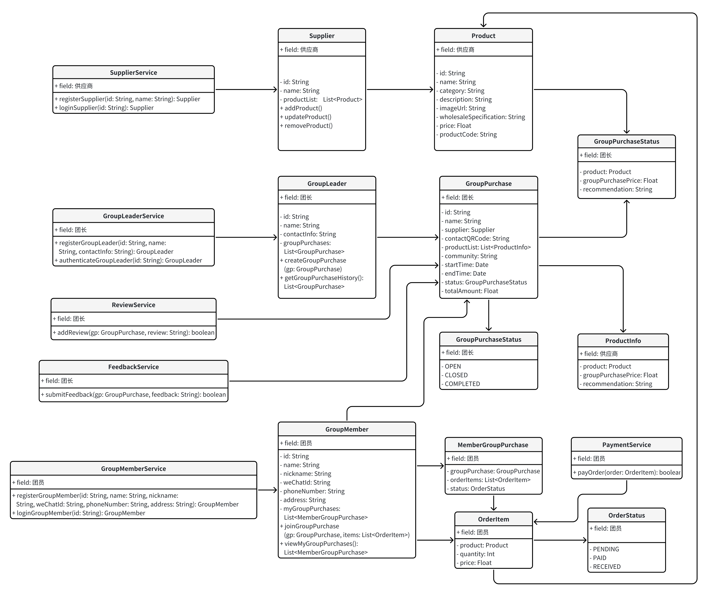

# 领域模型设计

## 系统结构
#### 1. 供应商端
- 发布商品信息：供应商可以在平台上发布其供应的商品信息。
- 管理订单信息：供应商可以管理和查看各团长的订购订单信息。
- 查看订单状态：供应商能够实时查看订单的状态。
- 收款信息：供应商可以查看和管理订单的收款信息。

#### 2. 团长端
- 开团：团长用户可以发起团购活动。
- 团购管理：团长可以对自己所发起的团购活动进行全生命周期的管理。
- 投诉和评价查看：团长可以查看用户对其团购活动的投诉和评价信息。

#### 3. 团员端
- 浏览团购列表：用户可以浏览平台上所有的团购活动。
- 注册参团：用户在注册后可以选择加入某个团购活动并选购商品。
- 订单查询：用户可以查询自己参与的团购订单信息。
- 投诉和评价：用户可以对参与的团购活动进行投诉和评价。

#### 4. 平台运维端
- 团长认证：运维人员负责对团长的认证工作。
- 系统管理功能：包括系统维护和管理的其他功能。

#### 5. 职能监管端
- 查看交易数据：监管人员可以查看平台上的主要交易数据。
- 投诉和评价信息：监管人员可以查看用户的投诉和评价信息，以进行监督和管理。

## 领域模型设计

### 领域驱动设计

现代微服务系统一般涉及的业务流程多，系统交互场景丰富，为了合理切分业务领域，恰当定义业务边界，并以此开发出“高内聚，低耦合”的代码，采用DDD（Domain-Driven Design）领域驱动设计思想就能很好地实现这个目标，根据业务领域合理分层软件架构，让系统拓展性更强，结构更清晰，更灵活，复用程度更高，轻松应对各种复杂的业务需求。

领域驱动设计（Domain-Driven Design 简称DDD），是一套综合软件系统分析和设计的面对对象建模方法，采用领域模型概念，统一分析和设计编程，使软件能够更加灵活快速地跟随需求变化。领域驱动设计的核心在领域模型，领域模型的核心在业务知识。

### 领域与对象

#### 领域（Domain）

领域是指系统中业务逻辑和操作所涉及的主要业务模块或业务范围。以下是设计中的主要领域：

1. 供应商管理
   - 涉及供应商发布和维护商品清单的功能。
2. 团长管理
   - 涉及团长创建和管理团购活动的功能，包括一键开团和查询历史团购信息。
3. 团员管理
   - 涉及团员注册、参团和查看自己团购信息的功能。

#### 对象（Objects）

对象是领域中的具体实体，每个对象都具有属性和行为。以下是设计中的主要对象：

**1. 供应商管理领域的对象**

- Supplier
- Product

**2. 团长管理领域的对象**

- GroupLeader
- GroupPurchase
- ProductInfo
- GroupPurchaseStatus

**3. 团员管理领域的对象**

- GroupMember
- MemberGroupPurchase
- OrderItem
- OrderStatus

### 领域和对象的关系

领域是更大的对象，是可以直接产生业务价值的模型，只包含多对象的行为整合，不包含对象的属性，从而实现领域的行为共享。

领域模型是对业务需求的一种抽象，表达了领域概念、领域规则以及领域概念之间的关系。一个好的领域模型是对统一语言的可视化表示，通过它可以减少需求沟通可能出现的歧义；通过提炼领域知识，并运用抽象的领域模型去表达，就可以达到对领域逻辑的化繁为简。模型是封装，实现了对业务细节的隐藏；模型是抽象，提取了领域知识的共同特征，保留了面对变化时能够良好拓展的可能性。

领域模型以可视化的方式清晰地表达了业务含义，我们可以根据这个模型来指导后面的程序设计与编码实现。当增加新的需求或者需求发生变化时，我们能够敏锐地捕捉到现有模型的不匹配之处，并对其进行更新。领域模型传递了知识，可以作为交流的载体，符合人们的心智模型，有利于让开发人员从纷繁复杂的业务中解脱出来。

- **供应商（Supplier）** 是发布商品的主体，包含多个 **商品（Product）**。
- **团长（GroupLeader）** 可以创建 **团购（GroupPurchase）**，每个团购由某个供应商提供商品，团购中包含多个 **商品信息（ProductInfo）**。
- **团员（GroupMember）** 参与团购，可以加入团购并选择购买 **订单项（OrderItem）**，这些订单项属于某个团购。
- **团员团购信息（MemberGroupPurchase）** 用于记录团员参与的团购及其订单项，状态由 **订单状态（OrderStatus）** 表示。

```plaintext
1. 供应商管理领域的对象
  - SupplierService
    - registerSupplier(id: String, name: String): Supplier
    - loginSupplier(id: String): Supplier

  - Supplier
    - id: String
    - name: String
    - productList: List<Product>
    - addProduct(product: Product)
    - updateProduct(product: Product)
    - removeProduct(productId: String)
    
  - Product
    - id: String
    - name: String
    - category: String
    - description: String
    - imageUrl: String
    - wholesaleSpecification: String
    - price: Float
    - productCode: String
    
2. 团长管理领域的对象
  - GroupMemberService
	- registerGroupMember(id: String, name: String, nickname: String, weChatId: String, phoneNumber: String, address: String): GroupMember
	- oginGroupMember(id: String): GroupMember

  - GroupLeader
    - id: String
    - name: String
    - contactInfo: String
    - groupPurchases: List<GroupPurchase>
    - createGroupPurchase(gp: GroupPurchase)
    - getGroupPurchaseHistory(): List<GroupPurchase>
    
  - GroupPurchase
    - id: String
    - name: String
    - supplier: Supplier
    - contactQRCode: String
    - productList: List<ProductInfo>
    - community: String
    - startTime: Date
    - endTime: Date
    - status: GroupPurchaseStatus
    - totalAmount: Float
    
  - ProductInfo
    - product: Product
    - groupPurchasePrice: Float
    - recommendation: String
    
  - GroupPurchaseStatus
    - OPEN
    - CLOSED
    - COMPLETED
    
  - ReviewService
  	- addReview(gp: GroupPurchase, review: String): boolean
  
  - FeedbackService
	- submitFeedback(gp: GroupPurchase, feedback: String): boolean
    
3. 团员管理领域的对象
  - GroupMemberService
	- registerGroupMember(id: String, name: String, nickname: String, weChatId: String, phoneNumber: String, address: String): GroupMember
	- loginGroupMember(id: String): GroupMember
  
  - GroupMember
    - id: String
    - name: String
    - nickname: String
    - weChatId: String
    - phoneNumber: String
    - address: String
    - myGroupPurchases: List<MemberGroupPurchase>
    - joinGroupPurchase(gp: GroupPurchase, items: List<OrderItem>)
    - viewMyGroupPurchases(): List<MemberGroupPurchase>
    
  - MemberGroupPurchase
    - groupPurchase: GroupPurchase
    - orderItems: List<OrderItem>
    - status: OrderStatus
    
  - OrderItem
    - product: Product
    - quantity: Int
    - price: Float
    
  - OrderStatus
    - PENDING
    - PAID
    - RECEIVED
    
  - PaymentService
	- payOrder(order: OrderItem): boolean

```



#### 模型解释

- **供应商 (Supplier)**：负责发布和维护商品清单。可以增加、更新和删除商品。
- **商品 (Product)**：商品的详细信息，包括名称、分类、描述、图片、批发规格、价格和商品编码。
- **团长 (GroupLeader)**：可以一键开团，管理团购信息，并查询历史团购信息。
- **团购 (GroupPurchase)**：团购的详细信息，包括团购名称、供应商、联系二维码、商品信息、服务小区、团购时间和状态。
- **商品信息 (ProductInfo)**：团购中的商品信息，包含商品、团购价格和推荐理由。
- **团购状态 (GroupPurchaseStatus)**：团购的状态，包括开团中（OPEN）、已截团（CLOSED）和已完成（COMPLETED）。
- **团员 (GroupMember)**：可以参团并查看自己的团购信息。
- **团员团购信息 (MemberGroupPurchase)**：团员参与的团购信息，包含团购信息、订单项和订单状态。
- **订单项 (OrderItem)**：订单中的商品及其数量和价格。
- **订单状态 (OrderStatus)**：订单的状态，包括待处理（PENDING）、已支付（PAID）和已收货（RECEIVED）。

### **流程示例**

#### 供应商如何发布和维护商品清单

##### 1. 供应商注册与登录

供应商可以通过系统的注册和登录功能进行注册和登录，获取系统使用权限。

```
SupplierService
+ registerSupplier(id: String, name: String): Supplier
+ loginSupplier(id: String): Supplier
```

##### 2. 发布商品

供应商登录后可以发布新的商品，通过调用 `addProduct` 方法将商品信息添加到商品列表中。

```
Supplier
+ addProduct(product: Product)
```

##### 3. 维护商品信息

供应商可以通过调用 `updateProduct` 方法更新商品信息，通过调用 `removeProduct` 方法删除商品。

```
Supplier
+ updateProduct(product: Product)
+ removeProduct(productId: String)
```

##### 4. 商品清单管理

供应商可以查看和管理其商品清单，通过 `productList` 属性获取商品列表。

```
Supplier
- productList: List<Product>
```

#### 团长如何开团和管理团购

##### 1. 团长注册与认证

团长可以通过系统的注册和认证功能进行注册和认证，获取开团权限。

```
GroupLeaderService
+ registerGroupLeader(id: String, name: String, contactInfo: String): GroupLeader
+ authenticateGroupLeader(id: String): GroupLeader
```

##### 2. 选择商品开团

团长登录后可以浏览供应商的商品，选择商品进行开团。

```
GroupLeader
- supplierProducts: List<Product>
```

##### 3. 一键开团

团长选择商品后，通过调用 `createGroupPurchase` 方法发起团购。

```
GroupLeader
+ createGroupPurchase(gp: GroupPurchase)
```

##### 4. 管理团购

团长可以通过 `groupPurchases` 属性查看和管理其发起的团购。

```
GroupLeader
- groupPurchases: List<GroupPurchase>
```

##### 5. 查询历史团购信息

团长可以通过调用 `getGroupPurchaseHistory` 方法获取历史团购信息。

```
GroupLeader
+ getGroupPurchaseHistory(): List<GroupPurchase>
```

#### 团员如何参团和查看自身团购信息

##### 1. 团员注册与登录

团员可以通过系统的注册和登录功能进行注册和登录，获取参团权限。

```
GroupMemberService
+ registerGroupMember(id: String, name: String, nickname: String, weChatId: String, phoneNumber: String, address: String): GroupMember
+ loginGroupMember(id: String): GroupMember
```

##### 2. 浏览团购

团员登录后可以浏览当前可参与的团购。

```
GroupMember
- availableGroupPurchases: List<GroupPurchase>
```

##### 3. 参团

团员选择团购后，通过调用 `joinGroupPurchase` 方法参与团购，选择商品并加入购物车。

```
GroupMember
+ joinGroupPurchase(gp: GroupPurchase, items: List<OrderItem>)
```

##### 4. 订单支付

团员在参团后需要支付订单，通过支付服务完成支付。

```
PaymentService
+ payOrder(order: OrderItem): boolean
```

##### 5. 查看团购信息

团员可以通过 `myGroupPurchases` 属性查看其参与的团购信息。

```
GroupMember
- myGroupPurchases: List<MemberGroupPurchase>
```

##### 6. 订单状态跟踪

团员可以查看其订单的状态。

```
MemberGroupPurchase
- status: OrderStatus
```

##### 7. 评价团购

团员可以对参与的团购进行评价。

```
ReviewService
+ addReview(gp: GroupPurchase, review: String): boolean
```

##### 8. 投诉与反馈

团员可以对团购进行投诉与反馈。

```
FeedbackService
+ submitFeedback(gp: GroupPurchase, feedback: String): boolean
```

### 设计模式分析

#### 1. 单一职责原则（Single Responsibility Principle, SRP）

每个类在设计时都遵循单一职责原则，即每个类只负责一项功能。这种设计方式使得类的职责清晰，易于维护和扩展。

- **Supplier** 类负责供应商的商品管理。
- **GroupLeader** 类负责团长的团购管理。
- **GroupMember** 类负责团员的参团管理。

#### 2. 依赖倒置原则（Dependency Inversion Principle, DIP）

在设计中，模块之间的依赖关系遵循依赖倒置原则，高层模块不依赖于低层模块，二者都依赖于抽象。抽象不依赖于具体，实现依赖于抽象。

- 通过服务类（例如 `SupplierService`、`GroupLeaderService`、`GroupMemberService`）提供高层的业务逻辑，而这些服务类通过依赖注入（Dependency Injection）来获得低层依赖。

#### 3. 工厂模式（Factory Pattern）

使用工厂模式来创建对象，避免直接使用构造函数，提高代码的可维护性和可扩展性。

- 在服务类（例如 `SupplierService`、`GroupLeaderService`）中，使用工厂方法创建供应商、团长和团员对象。

#### 4. 门面模式（Facade Pattern）

通过门面模式，提供了一个统一的接口，用来访问子系统中的一群接口。门面模式定义了一个高层接口，使得这一子系统更加容易使用。

- **服务类**（例如 `SupplierService`、`GroupLeaderService`、`GroupMemberService`）充当了门面，为客户端提供了简单的接口来执行复杂的操作。

#### 5. 观察者模式（Observer Pattern）

观察者模式用于在对象间定义一种一对多的依赖关系，以便当一个对象的状态发生变化时，所有依赖于它的对象都会得到通知并自动更新。

- 可能在订单状态变更和通知系统之间应用观察者模式，使得订单状态变更时，相关的系统组件（例如通知系统）能够自动得到更新。

#### 6. 数据访问对象模式（Data Access Object Pattern, DAO）

数据访问对象模式将数据访问逻辑与业务逻辑分离，使得业务逻辑无需关注数据存储的细节，便于数据访问层的替换和维护。

- 可以在实现过程中使用 DAO 模式来处理数据库的CRUD操作。

#### 7. 模板方法模式（Template Method Pattern）

模板方法模式在一个方法中定义一个算法的骨架，而将一些步骤延迟到子类中。模板方法使得子类可以在不改变算法结构的情况下，重新定义算法中的某些步骤。

- 在一些服务方法中，可以使用模板方法模式定义处理流程的骨架，并允许子类提供具体实现。