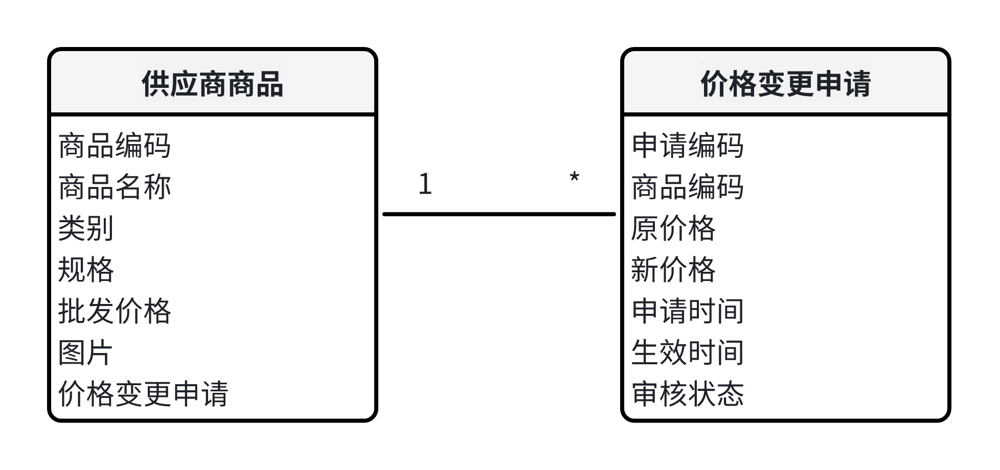
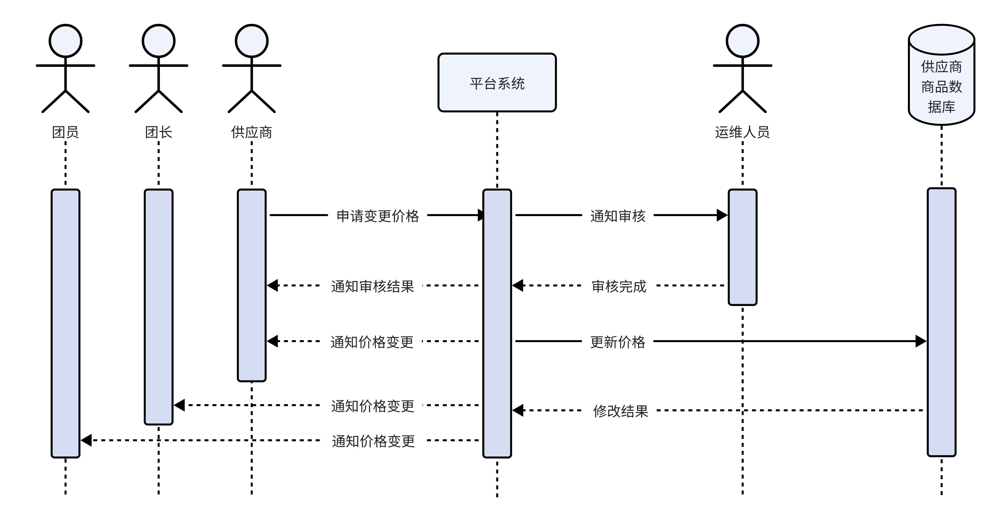
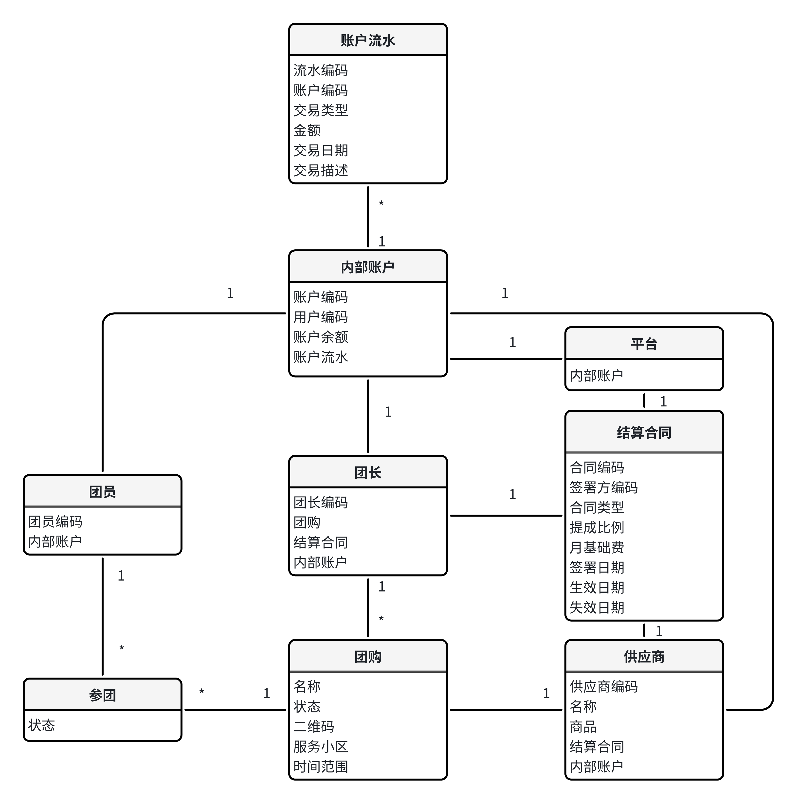
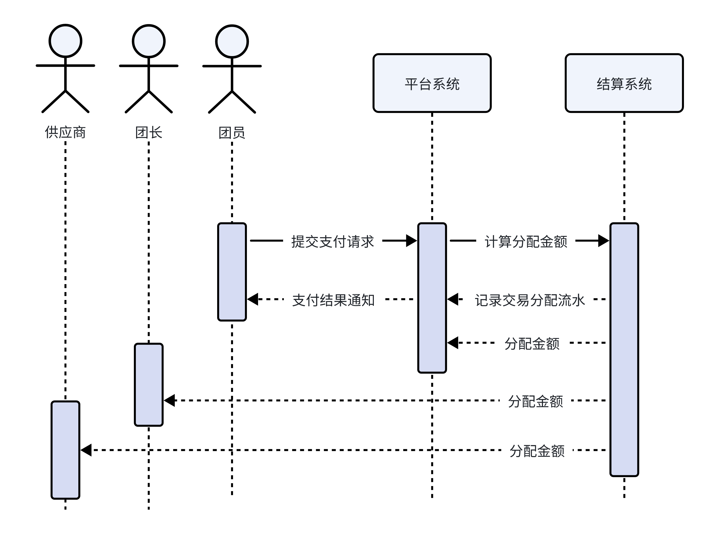
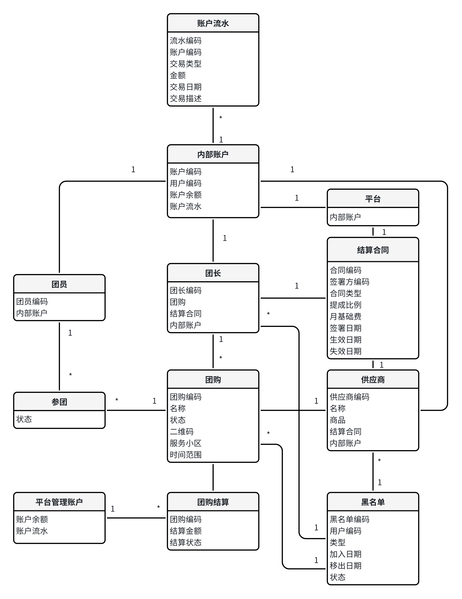
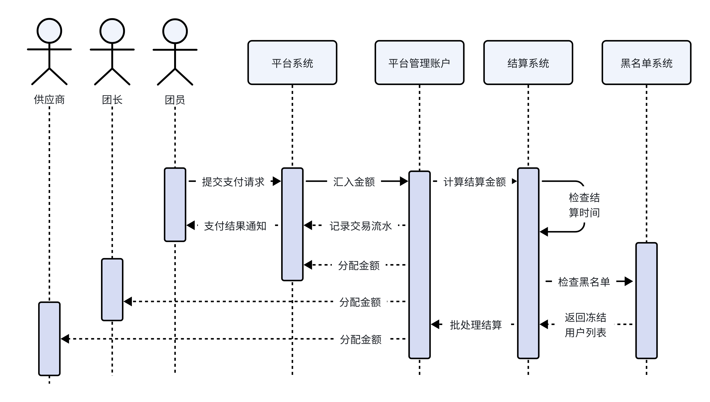
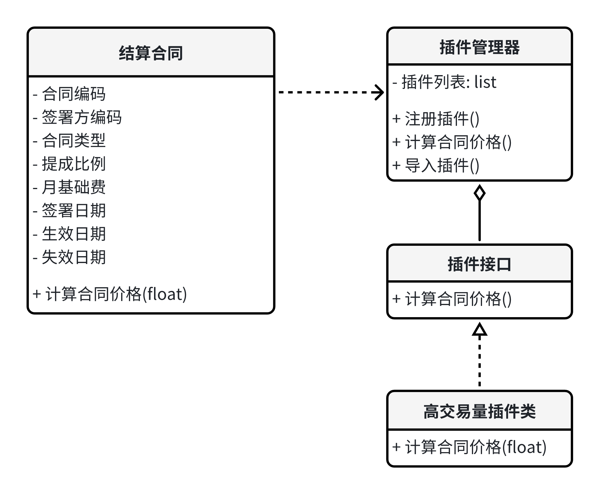
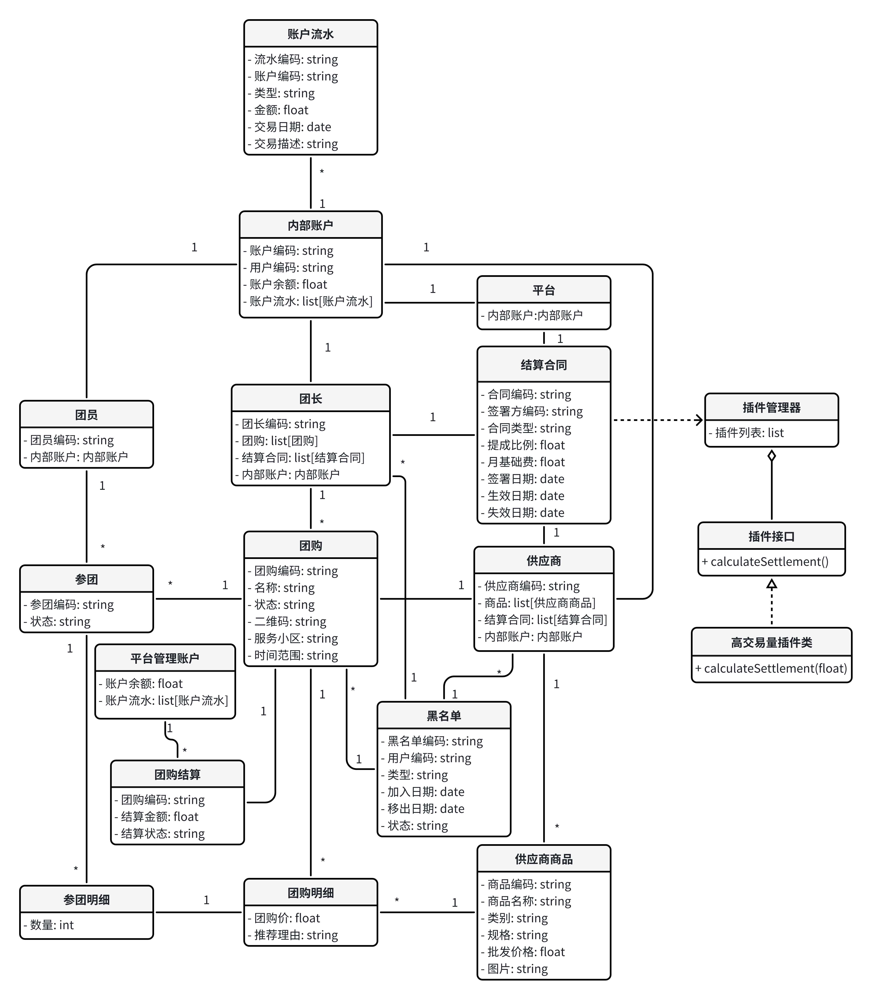
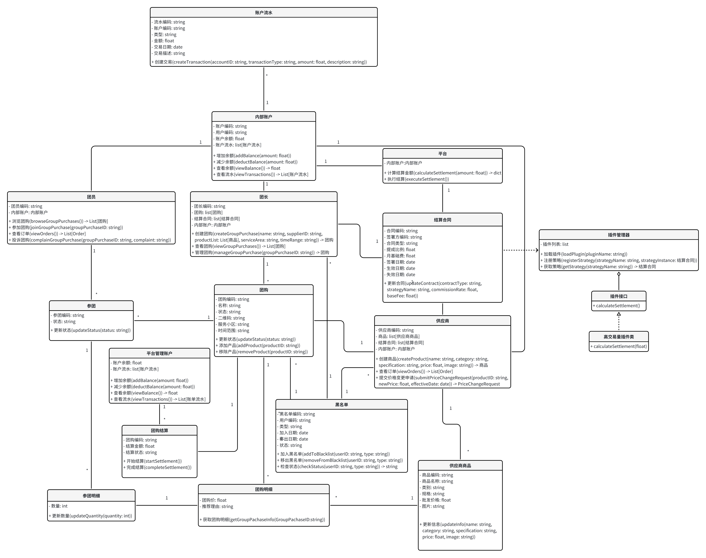

# Phase2

### 一、价格变更机制设计

#### 机制设计

**价格变更限制**:

- 一旦商品发布，供应商不能直接修改商品的内容。
- 供应商只能提交价格变更申请。

**价格变更申请流程**:

- 供应商在供应商端提交价格变更申请，包含新的价格和变更生效时间。
- 系统对变更申请进行审核（可由平台运维人员审核）。
- 审核通过后，新价格在指定的生效时间自动更新，并通知所有相关团长和团员。

**变更通知**:；

- 系统在变更生效前通知所有正在进行的团购相关团长，说明价格将变更及变更生效时间。
- 通知所有相关团员，确保他们了解变更情况。

#### 设计模型

可以在设计模型中增加一个 `价格变更申请` 实体，并调整与现有 `供应商商品` 实体的关系。

**价格变更申请**:

- 属性：申请编码、商品编码、原价格、新价格、申请时间、生效时间、审核状态
- 关系：与供应商商品一对多关系

#### 顺序图

1. **供应商提交申请**：供应商通过系统界面提交价格变更申请，填写商品编码、新价格和生效时间。
2. **系统审核申请**：系统将申请提交给平台运维人员进行审核。
3. **平台运维人员审核**：平台运维人员审核通过后，系统记录审核结果并通知供应商。
4. **变更通知**：系统在变更生效前通知所有相关团长和团员。
5. **价格生效**：到达生效时间时，系统自动更新商品价格，并通知供应商价格已变更。

### 二、基础支付模块设计

#### 设计模型

需要在设计模型中增加 `结算合同`、`内部账户`、`账户流水` 实体。

**结算合同**:

- 属性：合同编码、签署方编码（供应商或团长）、合同类型、提成比例、基础费、签署日期、生效日期、失效日期
- 关系：与供应商或团长一对一关系

**内部账户**:

- 属性：账户编码、用户编码（团长、供应商、平台、团员）、账户余额
- 关系：每个用户（团长、供应商、平台、团员）对应一个内部账户

**账户流水**:

- 属性：流水编码、账户编码、交易类型、金额、交易日期、交易描述
- 关系：与内部账户一对多关系

#### 顺序图

1. **团员提交支付请求**：团员在系统中选择商品并发起支付请求。
2. **系统计算提成**：系统根据结算合同计算支付金额的分配比例。
3. **打入各个账户**：系统将计算出的金额分别打入供应商、团长和平台的内部账户。
4. **记录流水**：系统记录每个账户的交易流水，包含金额、交易类型、交易日期和描述。
5. **支付成功通知**：系统向团员发送支付成功的通知。

### 三、定期结算支付模块设计

#### 设计模型

需要在基础的支付设计模型中增加 `团购结算`、`平台管理账户`、`黑名单` 实体。

**团购结算**:

- 属性：团购编码、结算金额、结算状态
- 关系：与团购一对一关系

**平台管理账户**:

- 属性：账户余额、账户流水
- 关系：整个平台有一个总的管理账户，负责存储各个团购的结算

**黑名单**:

- 属性：黑名单编码、用户编码、类型、加入日期、移出日期、状态
- 关系：与团长、供应商、团购一对多关系

#### 顺序图

1. **定时器启动批处理结算**：系统定时器定期触发结算批处理。
2. **检查黑名单**：系统检查黑名单模块，获取冻结的团长、供应商和团购信息。
3. **计算未结算金额**：系统对未结算金额进行计算，并排除黑名单中的用户和团购。
4. **分配金额**：系统按照结算规则将未结算金额分配到供应商、团长和平台的内部账户。
5. **更新账户余额**：系统更新内部账户的余额。
6. **记录交易**：系统记录账户流水，保存每笔交易的详细信息。

### 四、支持多种结算合同的形式

可以引入 `策略模式` 和 `插件机制`，使得结算规则可以灵活地添加和修改。策略模式允许定义一系列算法，将每一个算法封装起来，并使它们可以互相替换。本例中，具体的结算规则即为算法，通过插件的形式进行封装和替换。

- **基础结算合同类**：包含基本的合同信息和默认的提成计算方法。
- **插件接口**：定义了所有结算插件必须实现的方法。
- **高交易量插件类**：可以实现例子中在⼀个月内总⾦额超过100万后，平台提成从2%降低到1.8%的规则。
- **插件管理器**：负责管理和应用所有注册的插件。

### 五、静态领域模型设计

实现了上述的静态领域模型类的设计，以及对于最后支持多种结算合同的插件管理实现了动态方法的设计。但是对于上述顺序图中提及的方法，以及整个团购流程中使用的方法并未实现。

### 六、职责分配

实现了上述各类对应的职责和方法，整体完成了整个项目的设计。

